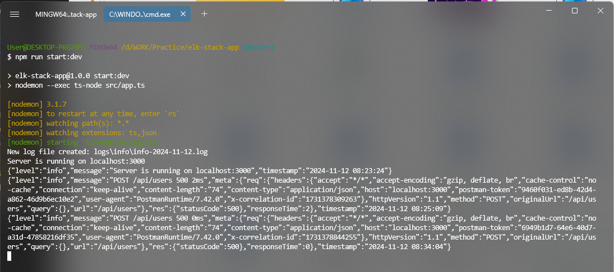

# Hands on Logging & ELK Stack

Logging is the process of recording events, activities, and data points that occur within a software application or system. It provides a way to track and monitor the behavior, performance, and potential issues of an application over time.

<!-- [Lecture - 131 | Hands on Logging using ELK Stack | Full-stack Army](https://youtu.be/swwx5GQUOAQ?si=ALgDUFweOB3yRA6c) -->

### Key aspects of logging:

- Helps in debugging and troubleshooting
- Provides insights into system performance
- Aids in security monitoring and auditing
- Supports compliance requirements

## What is ELK Stack?

ELK Stack is a collection of three open-source tools: Elasticsearch, Logstash, and Kibana. Together, they provide a powerful solution for log management and analytics.

### Components of ELK Stack:

- **Elasticsearch:** A distributed search and analytics engine
- **Logstash:** A data processing pipeline that ingests data from multiple sources
- **Kibana:** A data visualization and exploration tool

The ELK Stack allows organizations to collect logs from various sources, process and analyze them in real-time, and visualize the data through customizable dashboards. This enables better monitoring, faster troubleshooting, and improved decision-making based on data insights.

## What should and should not be logged ?

1. **What to Log:**
    - **Application Events:** Log critical application events, errors, warnings, and exceptions. These help in debugging and troubleshooting issues.
    - **Security Events:** Log authentication attempts, access control failures, and any suspicious activity. Security logs are crucial for monitoring and auditing.
    - **Performance Metrics:** Log performance-related data, such as response times, memory usage, CPU utilization, and database queries. This helps in identifying bottlenecks and optimizing performance.
    - **Business Transactions:** If your application handles financial transactions or other critical business processes, log relevant details to ensure data integrity.
    - **User Activity:** Log user interactions, such as login/logout events, page views, and actions taken within the application.
    - **External Integrations:** Log data related to external services or APIs your application interacts with.
2. **What Not to Log:**
    - **Sensitive Data:** Avoid logging sensitive information like passwords, credit card numbers, or personally identifiable information (PII). Instead, use techniques like tokenization or encryption.
    - **Raw Request/Response Bodies:** While it’s essential to log API requests and responses, avoid logging the entire raw payload. Log relevant metadata instead.
    - **Verbose Debugging Information:** Debug logs can be helpful during development but are usually too noisy for production. Limit verbose debug messages.
    - **Static Content or Unchanging Data:** Logging static content (e.g., CSS files) or data that doesn’t change frequently wastes storage space.
    - **Health Checks or Routine Pings:** These routine checks clutter logs and provide little value.

Remember that the balance between logging enough information for troubleshooting and avoiding excessive noise is crucial. Regularly review your logs, adjust log levels, and ensure compliance with privacy regulations.

## Popular Logging Solution:

- Splunk
- Datadog
- Loggly
- ELK (ElasticSearch, Logstash, Kibana)

## Applying Logging with Node-JS (Express) Project

For Node-JS we are mostly using Winston for logging into our application. Here are some npm tools we needs to install for Node application `express-winston` , `winston`, `morgan`, `winston-daily-rotate-file`, `winston-elasticsearch` :—

⇒ Winston

[npm: winston](https://www.npmjs.com/package/winston)

⇒ Express-winston

[npm: express-winston](https://www.npmjs.com/package/express-winston)

⇒ Morgan

[npm: morgan](https://www.npmjs.com/package/morgan)

⇒ Winston Dailly Rotate File

[npm: winston-daily-rotate-file](https://www.npmjs.com/package/winston-daily-rotate-file)

⇒ Winston Elasticsearch

[npm: winston-elasticsearch](https://www.npmjs.com/package/winston-elasticsearch)

<aside>
💡

We just have to install those tools NPM Packages for logging setup into our application.

</aside>

We need extra some dependencies if you are using TypeScript project. Here are those things 

`npm install --save-dev @types/winston @types/express-winston @types/morgan`

<aside>
💡

Types are needed to working with TypeScript project if you are using.

</aside>

### Lets write log configuration file for Winston

[GitHub - winstonjs/winston at 2.x](https://github.com/winstonjs/winston/tree/2.x)

[A Complete Guide to Winston Logging in Node.js | Better Stack Community](https://betterstack.com/community/guides/logging/how-to-install-setup-and-use-winston-and-morgan-to-log-node-js-applications/#log-rotation-in-winston)

This file will be contains all logging config with transport settings and this module or method will be injectable (single responsibility and independent dependency module).

- Transport for console error showing.
- Transport for file based errors showing.
- **`my-app/src/utils/logger/logger.ts`**
    
    ```tsx
    import { createLogger, format } from 'winston';
    const { json, timestamp, combine } = format;
    
    // Console Transport..
    const consoleTransport = new transports.Console({
    	level: "info",
    	format: combine(timestamp(), json())
    });
    
    // File Transport..
    const fileTransport = new transports.File({
    	level: "info",
    	format: combine(timestamp(), json()),
    	filename: "logs/info/info.log"
    });
    
    const logger = createLogger({
    	transports: [consoleTransport, fileTransport],
    });
    
    export default logger;
    ```
    
    <aside>
    💡
    
    We have used 2 types of transport for logger. One is for showing logs into the server terminal / console and the other is for storing the logs into the file system.
    
    </aside>
    

Each `level` is given a specific integer priority. The higher the priority the more important the message is considered to be, and the lower the corresponding integer priority. Severity of all levels is assumed to be numerically **ascending** from most important to least important. For example, `npm` logging levels are prioritized from 0 to 5 (highest to lowest):

```jsx
{ 
		error: 0, 
		warn: 1, 
		info: 2, 
		verbose: 3, 
		debug: 4, 
		silly: 5 
}
```

Lets using one log as example of seeing it with our current configurations here. We can use it where we wants to showing logs for any information, error, warning, http etc.

- **`my-app/src/app.ts`**
    
    ```tsx
    import express, { Request, Response, Application } from "express";
    import { userRoute } from "./routes";
    import { logger } from "./utils";
    
    const app: Application = express();
    
    // ALL LOGS ARE WRITTEN HERE..
    logger.info("Server running with info message");
    logger.error("Error message");
    logger.warn("Warning message");
    logger.debug("Debug message");
    logger.verbose("Verbose message");
    logger.silly("Silly message");
    
    // Default Middlewares
    app.use(express.json());
    app.use(express.urlencoded({ extended: true }));
    
    // Default Route
    app.get("/", function (_request: Request, response: Response): void {
        response.send("Hello all");
    });
    
    // Routes
    app.use("/api/users", userRoute);
    
    app.use('*', function (_request: Request, response: Response): void {
        response.status(404).send("Resource Not found!");
    });
    
    const PORT: number = process.env.PORT ? parseInt(process.env.PORT) : 3000;
    const HOST: string = process.env.HOST || "localhost";
    
    app.listen(PORT, HOST, function () {
        console.log(`Server is running on ${HOST}:${PORT}`);
    });
    ```
    
    <aside>
    💡
    
    Even here is written for showing `verbose`, `debug`, `silly` but into the terminal from server here is only showing the logs for `error`, `warn`, `info` . Because in transport Console here the level is defined `info` . According to that until info its showing all errors after the level it won’t show any log messages.
    
    </aside>
    

Now lets have a look into the Logger file for seeing the separated files  will show logs for different results for. And we are looking for different destinations for different logs here.

- **`my-app/src/utils/logger/logger.ts`**
    
    ```tsx
    import { createLogger, format, transports } from "winston";
    const { combine, timestamp, json } = format;
    
    // Console Transport
    const consoleTransport = new transports.Console({
        level: "silly",
        format: combine(timestamp(), json()),
    });
    
    /**
     * File Transport
     * @param level - Log level
     * @returns File Transport
     */
    function fileTransportFunc(level: string = "info") {
        const fileTransport = new transports.File({
            level,
            filename: `logs/${level}/${level}.log`,
            format: combine(timestamp(), json()),
        });
    
        return fileTransport;
    }
    
    // File Transport Instance
    const errorFileTransport = fileTransportFunc("error");
    const warnFileTransport = fileTransportFunc("warn");
    const infoFileTransport = fileTransportFunc("info");
    const httpFileTransport = fileTransportFunc("http");
    const debugFileTransport = fileTransportFunc("debug");
    const verboseFileTransport = fileTransportFunc("verbose");
    const sillyFileTransport = fileTransportFunc("silly");
    
    // Logger Instance
    const logger = createLogger({
        transports: [
            consoleTransport,
            errorFileTransport,
            warnFileTransport,
            infoFileTransport,
            httpFileTransport,
            debugFileTransport,
            verboseFileTransport,
            sillyFileTransport,
        ],
    });
    
    export default logger;
    ```
    

### Using Winston-daily-rotate-file for Improvements

But wait, there’s more! Sometimes logs pile up like old newspapers in your garage. That’s where **winston-daily-rotate-file** comes in:

- **What Does It Do?**
    - It’s a transport plugin for Winston.
    - It logs messages to a rotating file, which can be configured based on time or file size.
    - Older logs can be auto-deleted (sayonara, ancient logs!).
    - Plus, it zips logs when they rotate.

Now,  we can modify our log file with Daily-rotate-file like this.

```tsx
/**
 * File Transport
 * @param level - Log level
 * @returns File Transport
 */
function fileTransportFunc(level: string = "info") {
    const fileTransport = new transports.DailyRotateFile({
        level,
        filename: `logs/${level}/${level}-%DATE%.log`,
        format: combine(timestamp(), json()),
        zippedArchive: true,
        maxSize: "20m",
        maxFiles: "14d",
    });

    return fileTransport;
}
```

<aside>
💡

Here we can see some more configuration properties to make it perfect. And also we can customize the date pattern with `datePattern` property here. 

</aside>

### Some Events also we can run based on cue

With Winston Rotate File we can make some events while doing some actions based on cue.

- Fire event when a log file is created
- Fire event when a log file is rotated
- Fire event when a log file is archived
- Fire event when a log file is deleted

```tsx
function fileTransportFunc(level: string = "info") {
    const fileTransport = new transports.DailyRotateFile({
        level,
        filename: `logs/${level}/${level}-%DATE%.log`,
        format: combine(timestamp(), json()),
        zippedArchive: true,
        maxSize: "20m",
        maxFiles: "14d",
    });

    return fileTransport;
}

// fired when a log file is created
fireTransportFunc().on("new", (filename) => {});

// fired when a log file is rotated
fireTransportFunc().on("rotate", (oldFilename, newFilename) => {});

// fired when a log file is archived
fireTransportFunc().on("archive", (zipFilename) => {});

// fired when a log file is deleted
fireTransportFunc().on("logRemoved", (removedFilename) => {});
```

<aside>
💡

So that is our need if we can do so we can do it easily by entering some events firing.

</aside>

### Adding middleware with logging system here

This is a middleware to working with Node (Express-JS) Application this is helps to check the each request and response for the express application.
• **Middleware Magic:** This is where **[`express-winston`](https://www.npmjs.com/package/express-winston)** enters the scene. It’s a middleware that integrates Winston with Express, capturing request and response details.

**Or**, we can use **Morgan** as the Http Request Logger Middleware. [Morgan](https://www.npmjs.com/package/morgan) is an HTTP request logger middleware for [Express](https://expressjs.com/) that automatically logs the details of incoming requests to the server (such as the remote IP Address, request method, HTTP version, response status, user agent, etc.), and generate the logs in the specified format. The main advantage of using Morgan is that it saves you the trouble of writing a custom middleware for this purpose.

- **`my-app/src/middlewares/http-logger.middleware.ts`**
    
    ```tsx
    import winstonExpressLogger from 'express-winston';
    import logger from '../utils/logger'; // Our log file location of winston
    
    const expressWinstonLogger = (level: string) => {
    	return winstonExpressLogger.logger({
    		level: level || "http",
    		winstonInstance: logger,
    		meta: true, // optional: control whether you want to log the meta data about the request (default to true)
        msg: "HTTP {{req.method}} {{req.url}}", // optional: customize the default logging message. E.g. "{{res.statusCode}} {{req.method}} {{res.responseTime}}ms {{req.url}}"
        expressFormat: true, // Use the default Express/morgan request formatting. Enabling this will override any msg if true. Will only output colors with colorize set to true
        colorize: false, // Color the text and status code, using the Express/morgan color palette (text: gray, status: default green, 3XX cyan, 4XX yellow, 5XX red).
    	});
    };
    
    /**
     * Express Winston Error Logger
     */
    const exprssWinstonErrorLogger = expressWinstonLogger("error");
    
    /**
     * Express Winston Info Logger
     */
    const expressWinstonInfoLogger = expressWinstonLogger("info");
    
    /**
     * Express Winston Http Logger
     */
    const expressWinstonHttpLogger = expressWinstonLogger("http");
    
    export {
        exprssWinstonErrorLogger,
        expressWinstonInfoLogger,
        expressWinstonHttpLogger
    };
    ```
    

Now, we need sort of unique `id` which we can call `correlation_id` to identify the error or information log with the server response collect from user feedbacks. And this is most important thing to track the actual error of the server.

Here we can see a diagram for `correlation_id` with generate it and use it.


<aside>

We can generate an ID before get into the service method of doing business logic, because error might happened while making or doing something at business logic level. And the `Correlation-Id` will be sent via request header like **`X-Correlation-Id`** is the name there.

</aside>

Let’s see the middleware who is responsible to take or create the correlation-id before going to the business logic layer or the service layer of the controller.

- **`my-app/src/middlewares/setCorrelationId.ts`**
    
    ```tsx
    import { Request, Response, NextFunction } from 'express';
    
    /**
     * Set Correlation ID Middleware
     * @param req - Request
     * @param res - Response
     * @param next - Next Function
     */
    const setCorrelationId = (req: Request, res: Response, next: NextFunction) => {
        const key = "x-correlation-id";
        const correlationId = req.headers[key] || Date.now().toString();
    
        // set the request header
        req.headers[key] = correlationId;
        // set the response headers
        res.set(key, correlationId);
        next();
    }
    
    export default setCorrelationId;
    ```
    
    <aside>
    💡
    
    It will create the correlation-id or it will be take from client end via header.
    
    </aside>
    

After getting the correlation-id now the turn is about using the id and doing the job done with that.

Using the middleware at the server’s global level with this.

- **`my-app/src/app.ts`**
    
    ```tsx
    import { Request, Response, NextFunction } from 'express';
    import { expressWinstonHttpLogger } from "./middlewares/http-logger.middleware";
    import correlationId from './middlewares/setCorrelationId';
    
    // Using the middleware with express application here..
    app.use(expressWinstonHttpLogger);
    app.use(correlationId);
    
    // Using with the global error handler here also..
    app.use((error, req: Request, res: Response, _next: NextFunction) => {
    	const errorObj = {
    		message: error?.message || 'Something went wrong',
    		correlationId: req.headers['x-correlation-id'],
    		status: error?.status || 500,
    	};
    	
    	logger.error(JSON.stringify(errorObj));
    	res.status(errorObj.status).json(errorObj);
    });
    ```
    
    <aside>
    💡
    
    The middleware using and adding into the global error handling middleware and also added logger to using the logging system to our Backend Server.
    
    </aside>
    

## Elasticsearch Logstash & Kibana (ELK-Stack)

Now lets follow the installation of Elasticsearch and Kibana for local/production environment here with Docker..

Installation of the Elasticsearch with Docker and Docker-Compose

[Install Elasticsearch with Docker | Elasticsearch Guide [7.5] | Elastic](https://www.elastic.co/guide/en/elasticsearch/reference/7.5/docker.html)

Installation of Kibana with Docker and Docker-Compose

[Install Kibana with Docker | Kibana Guide [8.15] | Elastic](https://www.elastic.co/guide/en/kibana/current/docker.html)

### Configure with Node-JS project (with Docker is most easier way)

Into the projects root you have to make `docker-compose.yaml` file for configure Elasticsearch and Kibana.

- **`my-app/docker-compose.yaml`**
    
    ```yaml
    version: "3.9"
    
    services:
      # region: Elasticsearch
      elasticsearch:
        image: elasticsearch:7.9.2
        container_name: elasticsearch
        restart: always
        ports:
          - 9200:9200
          - 9300:9300
        environment:
          - "ES_JAVA_OPTS=-Xms512m -Xmx512m"
          - discovery.type=single-node
        networks:
          - elk-stack
    
      # region: Kibana
      kibana:
        image: kibana:7.9.2
        container_name: kibana
        restart: always
        depends_on:
          - elasticsearch
        ports:
          - 5601:5601
        networks:
          - elk-stack
        environment:
          - "ELASTICSEARCH_URL=http://elasticsearch:9200"
    
    networks:
      elk-stack:
        name: elk-stack
        driver: bridge
        ipam:
          config:
            - subnet: 172.1.1.0/24
    ```
    
    <aside>
    💡
    
    This will help to start Elasticsearch and Kibana on with Docker for our app.
    
    </aside>
    

⇒ Then we have to start the docker services with this following command.

—> `docker-compose up`

Now we can check the servers are running into the local environment here. And we can see the Elasticsearch client page and Kibana page and also with Kibana log tools. 

For Elasticsearch → **`http://localhost:9200`**

For Kibana → **`http://localhost:5601`**

### Configure with the application here (Node.js App)

Now we have to use the transporter for the Elasticsearch Logstash and Kibana with our own created Node.js logging setup. 

Then we can use the tool called [**`winston-elasticsearch`](https://www.npmjs.com/package/winston-elasticsearch)** or we can use [**`winston-logstash`**](https://www.npmjs.com/package/winston-logstash) as transport of Elasticsearch. 

Let’s configure Elasticsearch with transport into our project. Using with this version here for compatibility → `winston-elasticsearch@0.10.0`  → `v0.10.0`

- **`my-app/src/utils/logger/logger.ts`**
    
    ```tsx
    import { createLogger, format, transports } from "winston";
    import { ElasticsearchTransport } from 'winston-elasticsearch';
    const { combine, timestamp, json } = format;
    
    // Elasticsearch Transport..[HERE]
    const elasticSearchTransport = new ElasticsearchTransport({
    	level: "http", // Will show all logs until http level into Elasticsearch
    	clientOpts: {
    		node: "http://localhost:9200", // URL of Elasticsearch local server
    	},
    	indexPrefix: "logs-express", // The index name should be use on Kibana to search
    	indexSuffixPattern: "YYYY-MM-DD",
    });
    
    // Console Transport..
    const consoleTransport = new transports.Console({
        level: "http",
        format: combine(timestamp(), json()),
    });
    
    /**
     * File Transport
     * @param level - Log level
     * @returns File Transport
     */
    function fileTransportFunc(level: string = "info") {
        const fileTransport = new transports.File({
            level,
            filename: `logs/${level}/${level}.log`,
            format: combine(timestamp(), json()),
        });
    
        return fileTransport;
    }
    
    // File Transport Instance..
    const errorFileTransport = fileTransportFunc("error");
    const infoFileTransport = fileTransportFunc("info");
    const httpFileTransport = fileTransportFunc("http");
    
    // Logger Instance
    const logger = createLogger({
        transports: [
            consoleTransport,
            errorFileTransport,
            infoFileTransport,
            httpFileTransport,
            elasticSearchTransport, // [HERE] used on logger instance
        ],
    });
    
    export default logger;
    ```
    
    <aside>
    💡
    
    Used Elasticsearch Transport and used the transport for the Instance of the logger creation.
    
    </aside>
    

### Refactoring the Codes to understands easily

We should refactor the logger codes into 2 parts like the index root file and the transports file should be separated. Then we can debug easily if anything to do at transport level or the configuration level.

—> Configuration root file

- **`my-app/src/utils/logger/index.ts`**
    
    ```tsx
    import { createLogger, format } from "winston";
    import {
        consoleTransport,
        errorFileTransport,
        infoFileTransport,
        httpFileTransport,
        elasticSearchTransport,
    } from "./transports";
    const { combine, timestamp, json } = format;
    
    /**
     * CREATE LOGGER INSTANCE
     */
    const logger = createLogger({
        transports: [
            consoleTransport,
            errorFileTransport,
            infoFileTransport,
            httpFileTransport,
            elasticSearchTransport,
        ],
        format: combine(timestamp({
            format: "YYYY-MM-DD HH:mm:ss"
        }), json()),
        exitOnError: false,
    });
    
    // Add error handling for the logger
    logger.on('error', (error) => {
        console.error('Logger Error:', error);
    });
    
    export default logger;
    ```
    
- **`my-app/src/utils/logger/transports.ts`**
    
    ```tsx
    import "winston-daily-rotate-file";
    import { format, transports } from "winston";
    import { ElasticsearchTransport} from 'winston-elasticsearch';
    const { combine, timestamp, json } = format;
    
    // Elasticsearch Transport
    const elasticSearchTransport = new ElasticsearchTransport({
        level: "http",
        clientOpts: {
            node: "http://localhost:9200",
            ssl: {
                rejectUnauthorized: false
            }
        },
        indexPrefix: "log-express",
        indexSuffixPattern: "YYYY.MM.DD",
        mappingTemplate: {
            index_patterns: ["log-express-*"],
            settings: {
                number_of_shards: 1,
                number_of_replicas: 0
            },
            mappings: {
                dynamic_templates: [{
                    message_field: {
                        path_match: 'message',
                        mapping: {
                            type: 'text',
                            fields: {
                                keyword: {
                                    type: 'keyword'
                                }
                            }
                        }
                    }
                }]
            },
        },
        ensureMappingTemplate: true,
        flushInterval: 2000,
    });
    
    // Add error handling
    elasticSearchTransport.on('error', (error) => {
        console.error('Elasticsearch Transport Error:', error);
    });
    
    // Add warning handling
    elasticSearchTransport.on('warning', (warning) => {
        console.warn('Elasticsearch Transport Warning:', warning);
    });
    
    // Console Transport
    const consoleTransport = new transports.Console({
        level: "http", // will show all logs until http level into console
        format: combine(timestamp(), json()),
    });
    
    /**
     * File Transport
     * @param level - Log level
     * @returns File Transport
     */
    function loggerFileTransport(level: string = "info") {
        const fileTransport = new transports.DailyRotateFile({
            level,
            filename: `logs/${level}/${level}-%DATE%.log`,
            format: combine(timestamp(), json()),
            datePattern: "YYYY-MM-DD",
            zippedArchive: true,
            maxSize: "1m",
            maxFiles: "1d",
        });
    
        return fileTransport;
    }
    
    // File Transport Instance
    const errorFileTransport = loggerFileTransport("error");
    const infoFileTransport = loggerFileTransport("info");
    const httpFileTransport = loggerFileTransport("http");
    
    // Some of the Events 
    // DailyRotateFiles Event
    loggerFileTransport().on("new", (newFilename) => {
        console.log(`New log file created: ${newFilename}`);
    });
    
    // Fire when a log file is rotated
    loggerFileTransport().on("rotate", (oldFilename, newFilename) => {
        console.log(`Rotating log file from ${oldFilename} to ${newFilename}`);
    });
    
    // Fire when a log file is archived
    loggerFileTransport().on("archive", (zipFilename) => {
        console.log(`Log file archived: ${zipFilename}`);
    });
    
    // Fire when a log file is deleted
    loggerFileTransport().on("delete", (deletedFilename) => {
        console.log(`Log file deleted: ${deletedFilename}`);
    });
    
    export {
        consoleTransport,
        errorFileTransport,
        infoFileTransport,
        httpFileTransport,
        elasticSearchTransport,
    };
    ```
    

<aside>
💡

Well now everything setup is done with multiple transports, but we can only use the ELK stack and not necessary using file and console based transports. 

</aside>

Let’s Explore the Elasticsearch and Kibana’s Local Servers as we are ran with the help of Docker. If we open one of our favorite browser and simply visit to those servers of [localhost](http://localhost) its like that actually.

**⇒ Elasticsearch Server on Local**


**⇒ Kibana Server on Local**


### Try to getting log by checking by invalid request API heating

Let’s make a route and a controller for checking the request tracking or not with requests middleware and global middleware is working or not with Elasticsearch Engine and Kibana Tool.

**⇒ Route Here**

This is the testing route for user we are mainly going to using the create user route to checking.

- **`my-app/src/routes/user.route.ts`**
    
    ```tsx
    import { Router } from "express";
    import { userController as UserController } from "../controllers";
    
    const router: Router = Router();
    const userControllerInstance: UserController = new UserController();
    
    /**
     * GET ALL USERS ROUTE
     */
    router.get("/", userControllerInstance.getAllUsers);
    
    /**
     * CREATE USER ROUTE
     */
    router.post("/", userControllerInstance.createUser);
    
    export default router;
    ```
    

**⇒ Controller Here**

The controller will help to handle request and the response from the routes request from client.

- **`my-app/src/controllers/user.controller.ts`**
    
    ```tsx
    import { Request, Response } from "express";
    import { userService as UserService } from "../services";
    import { IUser, IUserRequest } from "../shared";
    
    // User Service Instance
    const userServiceInstance: UserService = new UserService();
    
    /**
     * User Controller
     */
    class UserController {
        /**
         * ALL USERS CONTROLLER HERE
         * @param _req 
         * @param res 
         */
        public getAllUsers(_req: Request, res: Response): void {
            try {
                const users: IUser[] = userServiceInstance.getAllUsers();
                res.status(200).json({ message: "Users fetched successfully", users });
    
            } catch (error) {
                res.status(500).json({ message: "Internal server error" });
            }
        }
    
        /**
         * CREATE USER CONTROLLER HERE
         * @param _req 
         * @param res 
         */
        public createUser(req: Request, res: Response): void {
           try {
                const user: IUserRequest = req.body;
    
                if (!user.name || !user.email || !user.password) {
                    throw new Error("Name, email and password are required");
                }
    
                userServiceInstance.createUser(user);
                res.status(200).json({ message: "User created successfully", user });
    
            } catch (error) {
                res.status(500).json({ message: "Internal server error" });
           }
        }
    }
    
    export default UserController;
    
    ```
    

**⇒ Service Here** 

The Business logic of the Backend Application here this will help to create and read the user temporary DB. 

- **`my-app/src/services/user.service.ts`**
    
    ```tsx
    import { v4 as uuidv4 } from "uuid";
    import { IUser, IUserRequest } from "../shared";
    
    class UserService {
        private users: IUser[] = [
            {
                id: "1",
                email: "test@test.com",
                password: "test",
                updatedAt: new Date(),
                createdAt: new Date(),
            },
            {
                id: "2",
                email: "test2@test.com",
                password: "test2",
                createdAt: new Date(),
            },
        ];
    
        /**
         * Get all users
         * @returns IUser[]
         */
        public getAllUsers(): IUser[] {
            return this.users;
        }
    
        /**
         * Create a user
         * @param user - IUserRequest
         */
        public createUser(user: IUserRequest): void {
            const newUser: IUser = {
                id: uuidv4(),
                ...user,
                createdAt: new Date(),
            }
            this.users.push(newUser);
        }
    }
    
    export default UserService
    ```
    

<aside>
💡

Now just heat the route for create user with Postman / CURL

POST - `http://localhost:3000/api/users`

Body - 

```
{
    "email": "asad.anik@gmail.com",
    "password": "1223wedfgr35g"
}
```

</aside>

### Clear and Create Indexes with CURL

After our troubleshooting with Elasticsearch and Kibana then we can check the thing again. 

**⇒ Delete the previous index from Elasticsearch by CURL**

```bash
curl -X DELETE "localhost:9200/log-express-*"
```

**⇒ Create a new index template**

```bash
curl -X PUT "localhost:9200/_template/log-express" -H 'Content-Type: application/json' -d'
{
  "index_patterns": ["log-express-*"],
  "settings": {
    "number_of_shards": 1,
    "number_of_replicas": 0
  }
}'
```

Now we are going to check the Elasticsearch Response here, this is now green signal status from yellow status here.

### Checking Finally for Elasticsearch and Kibana

Here is the server console log are showing while we are not sending the all required request body while creating the user with that POST method API endpoint.

**⇒ Bash Terminal**



Now let’s check the Elasticsearch log is working with Kibana or not. We have to visit our Kibana local server and also a specific route for getting the status of our log. 

**⇒ Elasticsearch** [localhost](http://Localhost) **Server**


As we can see here is a log called `log-express-2024.11.12` which is the log of our application creating for Kibana.

**⇒ Kibana [localhost](https://www.notion.so/55b9e8adfcf9403e80d9c555894c4a46?pvs=21) Server**

Into the Kibana Server we have to create index again like first time creating by, 

`Sidebar → (Kibana Section) Discover` 

Then we can create the index prefix pattern to find our logs from our own transport we have configured into application.

